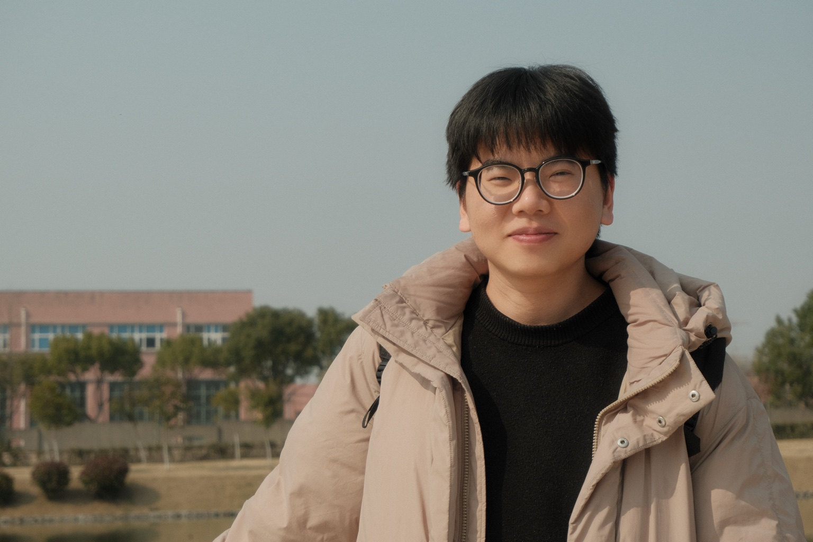

{: .profile-photo }

## Academic Profile

My research focuses on partial differential equations arising in physical and biological systems, including membrane biophysics and fluid dynamics, especially fluid-structure interaction. I develop mathematical models, design and analyze efficient numerical methods for their simulation, and study the well-posedness of the underlying PDE systems. I began this work as an undergraduate in Mathematics and Applied Mathematics at Shanghai Jiao Tong University from 2016 to 2020, continued it during my Ph.D. in Mathematics at Shanghai Jiao Tong University from 2020 to 2024 under the supervision of Wenjun Ying, and I am now a Postdoctoral Fellow in the Department of Mathematics at the University of Pennsylvania, where my host is Professor Yoichiro Mori.

**Email:** [hzhou24@sas.upenn.edu](mailto:hzhou24@sas.upenn.edu)  
**Affiliation:** Department of Mathematics, University of Pennsylvania  
**Office:** DRL 3N8B, David Rittenhouse Laboratory, Philadelphia, PA

## Publications and Preprints

1. **Pengsong Yin, Wenjun Ying, Yulin Zhang, Han Zhou.**  
   *A kernel-free boundary integral method for elliptic interface problems on surfaces.*  
   [arXiv:2508.16061](https://doi.org/10.48550/arXiv.2508.16061)

2. **Han Zhou, Yuan-Nan Young, Yoichiro Mori.**  
   *Modeling and Simulation of Open Membranes in Stokes Flow with Mixed-Dimensional Coupling.*  
   *Multiscale Modeling & Simulation*, 24(2):474-500, 2026. [DOI](https://doi.org/10.1137/25M1762476)

3. **Han Zhou, Wenjun Ying.**  
   *A Cartesian grid-based boundary integral method for moving interface problems.*  
   [arXiv:2309.01068](https://doi.org/10.48550/arXiv.2309.01068)

4. **Han Zhou, Minsheng Huang, Wenjun Ying.**  
   *ADI schemes for the heat equation on arbitrary 3D domains and their applications.*  
   [arXiv:2309.00979](https://doi.org/10.48550/arXiv.2309.00979)

5. **Han Zhou, Wenjun Ying.**  
   *A correction function-based kernel-free boundary integral method for elliptic PDEs with implicitly defined interfaces.*  
   *Journal of Computational Physics*, 496:112545, 2024. [DOI](https://doi.org/10.1016/j.jcp.2023.112545)

6. **Han Zhou, Jiahe Yang, Wenjun Ying.**  
   *A kernel-free boundary integral method for the nonlinear Poisson-Boltzmann equation.*  
   *Journal of Computational Physics*, 493:112423, 2023. [DOI](https://doi.org/10.1016/j.jcp.2023.112423)

7. **Han Zhou, Wenjun Ying.**  
   *A dimension splitting method for time dependent PDEs on irregular domains.*  
   *Journal of Scientific Computing*, 94(1):20, 2023. [DOI](https://doi.org/10.1007/s10915-022-02066-5)

8. **Han Zhou, Shuwang Li, Wenjun Ying.**  
   *An alternating direction implicit method for mean curvature flows.*  
   *Journal of Scientific Computing*, 101:65, 2024. [DOI](https://doi.org/10.1007/s10915-024-02701-3)

9. **Jiacheng Xu, Dan Hu, Han Zhou.**  
   *A phase-field method for elastic mechanics with large deformation.*  
   *Journal of Computational Physics*, 471:111630, 2022. [DOI](https://doi.org/10.1016/j.jcp.2022.111630)

## Talks

- *Kanazawa University - Penn Soft Matter / Applied Math Workshop*, University of Pennsylvania, Philadelphia, Pennsylvania, Mar. 23-25, 2026
- *Mathematical Modeling, Computational Methods, and Biological Fluid Dynamics: Research and Training*, NITMB, Chicago, Illinois, Aug. 2025
- *Numerical Analysis and PDE Seminar*, University of Delaware, Newark, Delaware, May 2025
- *Fluid Mechanics and Waves Seminar*, NJIT, Newark, Nov. 2024
- *NCTS Seminar on PDE and Machine Learning*, Online, Oct. 2024
- *The 10th International Congress on Industrial and Applied Mathematics*, Waseda University, Tokyo, Aug. 2023
- *SICIAM Workshop on Recent Advances in Fast Algorithms*, CUHK, Shenzhen, Aug. 2023
- *Chinese Mathematical Society in Computational Mathematics*, Nanjing Normal University, Nanjing, Jul. 2023
- *CSIAM Student Forum*, Online, Nov. 2022
- *Shanghai Symposium on Scientific and Engineering Computing Methods*, Shanghai, Nov. 2021

## Teaching

### University of Pennsylvania

- Instructor, AMCS 6035, *Numerical and Applied Analysis II*, Spring 2026
- Instructor, AMCS 6025, *Numerical and Applied Analysis I*, Fall 2025
- Instructor, AMCS 6035, *Numerical and Applied Analysis II*, Spring 2025
- Instructor, AMCS 6025, *Numerical and Applied Analysis I*, Fall 2024

### Shanghai Jiao Tong University

- Teaching Assistant, *Differential Geometry* (Fall 2023)
- Teaching Assistant, *Convex Optimization* (Spring 2022, Fall 2022)
- Teaching Assistant, *Scientific Computing* (Spring 2021, Fall 2021)
- Teaching Assistant, *Calculus* (Fall 2020)

## CV

<a class="button-link" href="/assets/files/Han_CV.pdf">Download CV (PDF)</a>
